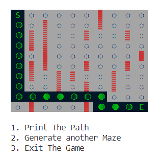

# Terminal-Based Maze Solver

This Terminal-Based Maze Solver is a command-line tool designed to find the solution to a maze inputted through text files. It offers a simple yet effective way to visualize and solve mazes without the need for a graphical interface.

## Features

- **Command-Line Interface**: Easy-to-use interface accessible from the terminal.
- **Support for Custom Mazes**: Ability to load custom maze files in text format.
- **Multiple Algorithms**: Supports various maze-solving algorithms for finding the solution.
- **Visual Representation**: Renders the maze and solution path in the terminal for visualization.

## Usage

To use the Terminal-Based Maze Solver, follow these steps:

1. **Clone the Repository**: Clone this repository to your local machine.

    ```
    git clone https://github.com/KishanKumar08/Terminal-Based-Maze-Solver.git
    ```

2. **Navigate to the Directory**: Move to the directory where the repository was cloned.

    ```
    cd Terminal-Based-Maze-Solver
    ```

3. **Install Dependencies (if any)**: If there are any dependencies required, make sure to install them. This might vary based on the specific implementation.

4. **Run the Solver**: Execute the solver script and provide the maze file as input.

    ```
    python mazesolver.py
    ```

5. **Follow Instructions**: Follow the instructions provided by the solver in the terminal to choose the algorithm and visualize the solution.

## Supported Algorithms

The following algorithms are currently supported by the Maze Solver:

- **Backtracking**
- **Breadth-First Search (BFS)**
<!-- - **A* Search Algorithm** -->

## Input Maze Format

Mazes should be provided in text files with the following format:

- **'▓'**: Denotes walls or barriers.
- **'S'**: Denotes the start point.
- **'E'**: Denotes the end point.
- **'◌' (space)**: Denotes the traversable path.

Example:




## Contributions

Contributions to this project are welcome! If you have any suggestions, bug reports, or feature requests, feel free to open an issue or create a pull request.


---

Enjoy solving mazes with the Terminal-Based Maze Solver! If you encounter any issues or have any questions, don't hesitate to reach out.


